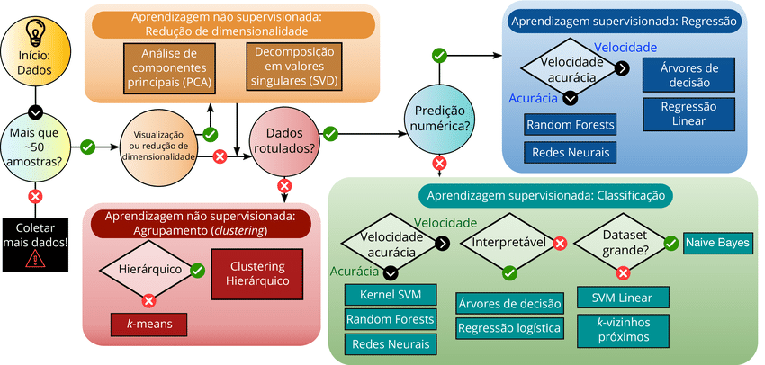

---
title: "Relatório em R Markdown"
author: "Lucas Araújo"
date: "`r Sys.Date()`"
output:
  html_document:
    toc: true
    toc_depth: 2
    theme: flatly
    code_folding: hide
    df_print: paged
---

# Introdução

Este relatório apresenta uma análise simples de dados, visualização interativa com `DT`, equações matemáticas em LaTeX, imagens relacionadas à ciência de dados e referências bibliográficas.

# Manipulação de Dados (Item 1) {.tabset}

## Carregamento de Dados

Utilizaremos o conjunto de dados `mtcars`, já incluso no R.

```{r}
data(mtcars)
head(mtcars)
```

## Manipulação de Dados

Vamos ordenar os carros pelo consumo de combustível (`mpg`), filtrar os que têm 6 cilindros e criar uma nova variável `eficiencia` com base no `mpg`.

```{r}
library(dplyr)

mtcars_mod <- mtcars %>%
  mutate(model = rownames(mtcars)) %>%
  arrange(desc(mpg)) %>%
  filter(cyl == 6) %>%
  mutate(eficiencia = ifelse(mpg > 20, "Alta", "Média"))

mtcars_mod
```

### Explicação:

- **`mutate(model = rownames(mtcars))`**: adiciona o nome do carro como uma variável.
- **`arrange(desc(mpg))`**: ordena do maior para o menor consumo.
- **`filter(cyl == 6)`**: seleciona carros com 6 cilindros.
- **`mutate(eficiencia = ifelse(mpg > 20, "Alta", "Média"))`**: classifica a eficiência com base no `mpg`.

# Tabela Interativa (Item 2) {.tabset}

```{r}
library(DT)

datatable(mtcars_mod,
          options = list(pageLength = 5, autoWidth = TRUE),
          rownames = FALSE)
```

# Equações em LaTeX (Item 3) {.tabset}

## Equações e Significados

**1. Fórmula de regressão linear:**

$$
y = \beta_0 + \beta_1 x + \varepsilon
$$  
*Representa a relação entre uma variável dependente `y` e uma independente `x`.*

---

**2. Gradiente descendente:**

$$
\theta := \theta - \alpha \nabla J(\theta)
$$  
*Utilizado para minimizar funções de custo em aprendizado de máquina.*

---

**3. Entropia de Shannon:**

$$
H(X) = - \sum_{i=1}^n p(x_i) \log p(x_i)
$$  
*Mede a incerteza de uma variável aleatória em teoria da informação.*

---

**4. Distribuição normal:**

$$
f(x) = \frac{1}{\sqrt{2\pi\sigma^2}} e^{ -\frac{(x - \mu)^2}{2\sigma^2} }
$$  
*Função densidade de probabilidade da normal com média `μ` e desvio padrão `σ`.*

---

**5. Matriz de covariância:**

$$
\Sigma = E[(X - \mu)(X - \mu)^T]
$$  
*Representa como duas variáveis variam juntas.*

# Figuras (Item 4) {.tabset}

## Figura 1: Ciclo de Ciência de Dados


## Figura 2: Diagrama de Machine Learning



# Referências Bibliográficas (Item 5) {.tabset}

1. James, G., Witten, D., Hastie, T., & Tibshirani, R. (2021). *An Introduction to Statistical Learning*. Springer.
2. Kuhn, M., & Johnson, K. (2013). *Applied Predictive Modeling*. Springer.
3. Bishop, C. M. (2006). *Pattern Recognition and Machine Learning*. Springer.
4. Provost, F., & Fawcett, T. (2013). *Data Science for Business*. O’Reilly Media.
5. Murphy, K. P. (2012). *Machine Learning: A Probabilistic Perspective*. MIT Press.

---
